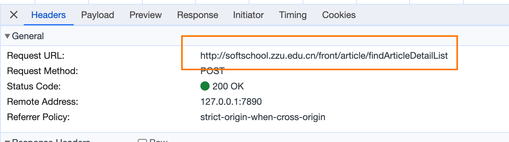
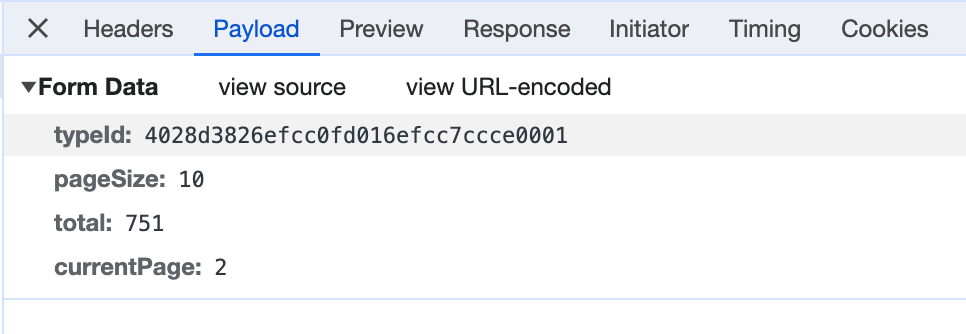
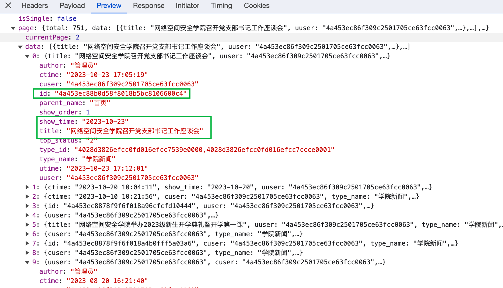
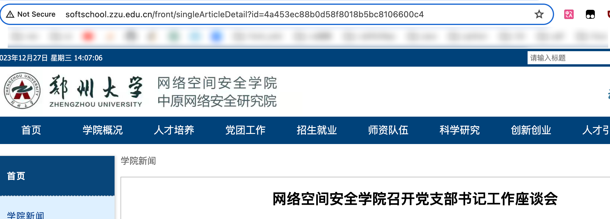

# 郑大网安院新闻和公告-爬虫

## 概述

该python爬虫自动爬取郑州大学网络空间安全学院网站上的新闻和公告,以html形式保存到本地

## 相关网页

学院网址官网:http://softschool.zzu.edu.cn/

学院新闻网址:http://softschool.zzu.edu.cn/front/detail?typeId=4028d3826efcc0fd016efcc7ccce0001

学院公告网址:http://softschool.zzu.edu.cn/front/detail?typeId=4028d3826efcc0fd016efcc9b70b0002

## 分析请求头和响应体

在学院新闻网站点击第二页,浏览器向服务器发送了请求


请求路径



携带参数



返回的是一个包含每条信息的title和show_time等信息的json串



注意到这条新闻url后的id就是上面json串中的id



由此能直接向服务器发起get请求,携带id参数

## 实现思路

* 将爬取的每一页json串中有用的title,id和show_time存入mysql数据库
* 保存完所有上述数据后,再一个一个发起请求获得相应html页面


注意,获得的html源码中的图片不能正常加载

解决方法是补全资源的路径

```python
# 处理页面中的img,加上资源前缀	http://softschool.zzu.edu.cn/file/showFile?fileId=4a453ec88ba53d71018c582400b60206
        content = resp.json()["content"].replace("/file/showFile", "http://softschool.zzu.edu.cn/file/showFile")
```

## 提高爬取速度

使用多线程和多进程提高爬取速度


## 数据库建表语句

```mysql
create database crawler;
use crawler;

create table news(
    id varchar(50),
    show_time varchar(20),
    title varchar(100)
);

create table announcements(
    id varchar(50),
    show_time varchar(20),
    title varchar(100)
);
```


# 相关依赖

```
certifi==2023.11.17
charset-normalizer==3.3.2
idna==3.6
mysql-connector-python==8.2.0
protobuf==4.21.12
requests==2.31.0
urllib3==2.1.0
```

